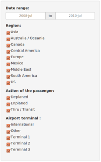
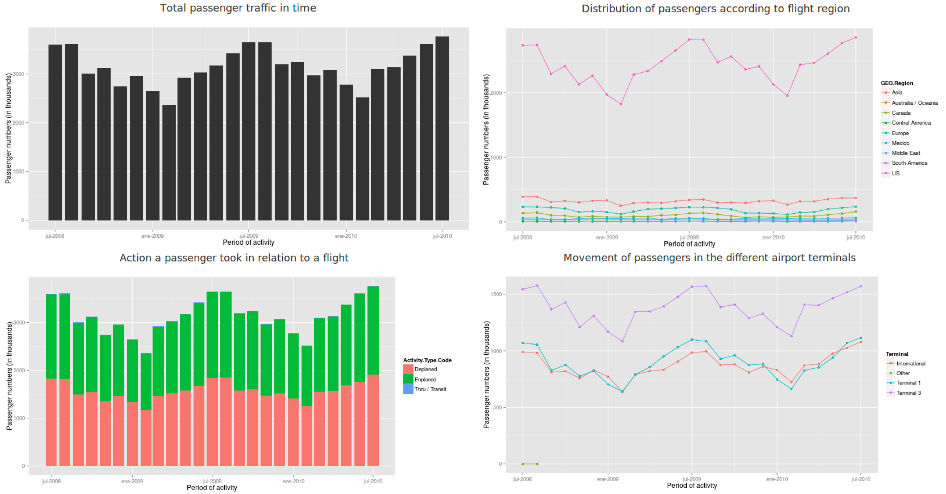

Overview
==================

This application above shows the movement of passengers in the San Francisco International Airport (SFO). The source data are obtained from the [Air Traffic Statistics](http://www.flysfo.com/media/facts-statistics/air-traffic-statistics) which contains data from to July 2005 and are updated quarterly (this application to handle data from July 2005 to March 2015, [download](https://github.com/anroco/Course_Project_Passenger_Movement_SFO/blob/master/data/Passenger.zip?raw=true)). The passenger dataset contains data about passenger traffic into and out of SFO with monthly totals by region, terminal, type of action performed by the passenger and other fields.

The code of the application is posted on [github](https://github.com/anroco/Course_Project_Passenger_Movement_SFO).

How to use
==================

The application is easy to use, this is divided into two sections on the left side you will find a panel with different filters to be applied as: activity period, region, terminal, and the type of activity carried by passengers.

* Date range: define the period of time at which passenger activity took place in the airport. The Activity Period is always defined in years and months, so when you select a specific day of the month is taken into account only the month and day is omitted.
* Region: define the region in the world where activity in relation to SFO arrive from or depart to without stops.
* Action of the passenger: A description of the physical action a passenger took in relation to a flight, which includes boarding a flight (“enplanements”), getting off a flight (“deplanements”) and transiting to another location (“in‐transit”).
* Airport terminal: The airport terminal designations at SFO where passenger activity took place.

In this panel you must select the types of information you want to search, the query result will be shown in different images on the panel to the right of the page.

The application displays four graphs as a result of the search:

* The total number of passengers who have moved into the airport over a period of time.
* Total of passenger for region of flight during a defined time period.
* Total passenger traffic according to the type of action (enplanements, deplanements, in-transit) over a period of time.
* Total passenger traffic according to the airport terminal over a period of time.

About
==================

This application was developed as the course project Developing Data Products as part of the Data Science specialization by anroco.
